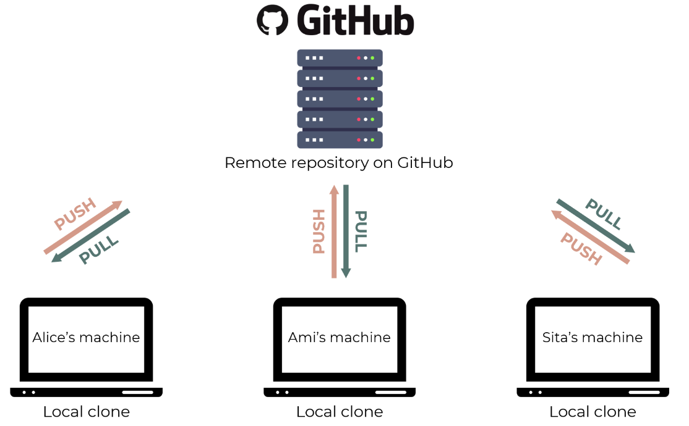

- ### Git

  - The software that allows us to do version control.
  - Like the “Track Changes” feature from Microsoft Word, but more rigorous, powerful, and scaled up to multiple files.

- ### GitHub
  - Hosting service for git projects (aka repositories) — essentially Dropbox for git projects.
  - You can host **remote** repositories on [https://github.com/](https://github.com/). You edit and work on your content in your **local** repository on your computer, and then you send your changes to the remote.
- You can interact with Git using the **Graphical User Interface (GUI)** provided by GitHub Desktop, or through the **Command Line Interface (CLI)**.

Next ==> [git-installation](./git-installation.md)

